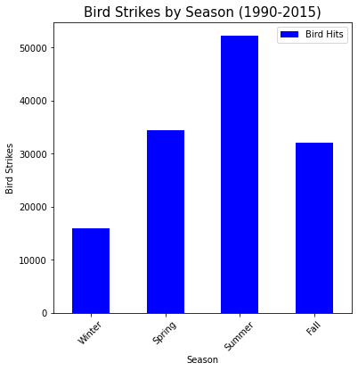
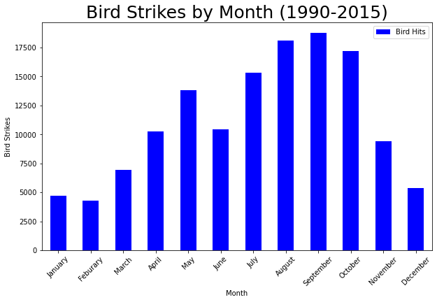

# Project_1

## Birds and Planes

Group 8 (Combat Wombats)

### Team Members

* Rongjun "Tom" Ding

* Joe Lubrano

* Kevin Lam

* Rafael Rodriguez

* Ramyata Umpaka

## Resources

The database that we worked with is database.csv. This database was found on www.kaggle.com with the link listed below.

[link to the database](https://www.kaggle.com/faa/wildlife-strikes)

Cleaned_data.csv- the final database after cleaning.

Brainstorming.txt

### Software

* Python 3

* Matplotlib

* Pandas

## Goal: Create awareness of the issue of birds striking airplanes and identify important factors related to this occurrence

Our team looked for trends and risks associated with bird strikes over a 15 year period (1990-2015) in the U.S. (states and territories) and Canada.

### Roles

* Data Cleaning - All team members

* Plane Damage Analysis - Ramyata Upmaka

* Statistical Analysis - Rafael Rodriguez

* Region Analysis - Joe Lubrano

* Bird Analysis - Kevin Lam

* Weather and Precipitation Analysis - Rongjun "Tom" Ding

### Cleaning Process

In our analysis we had decided to look at the territories within the United States. Cleaning was required as animals would appear that are not birds(e.g. deer, alligators, turtles, etc.). Further cleaning was needed to remove unknown and private planes. NAN records were changed to 0 as the database counted 0 as false. When appropiate the zeroes were removed from the database(e.g. Names). The result is the final database Cleaned_data.csv.

More indepth explanation of cleaning in "Cleaned_Database_Code.ipynb".

### Results / Findings

Upon finishing the analysis there are interesting findings.

When it comes to the frequency of bird strikes, a majority of them occur during the Summer by a large margin. When it came to the months the highest frequency of bird hits occur during September. August, September, and October have the three highest incident rate of bird hits. An even more interesting event is the rate of injury and death from the incidents. With January leading the way with the highest percentage of injury.

* See our powerpoint presentation for interesting analysis: "Project-1_CombatWombats.pptx"

* All of the images, plots and charts are saved in the "Output" and "Output_data" files

* Methodology for cleaning the database at the beginning of the projects is in "Cleaned_Database_Code.ipynb" and the data is saved as a .csv file in the "Resources" folder (Cleaned_data.csv)

* Individual analysis questions are examined in other jupyter notebooks
